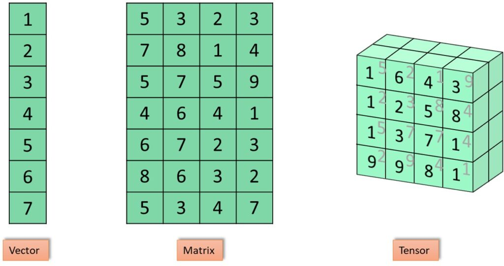
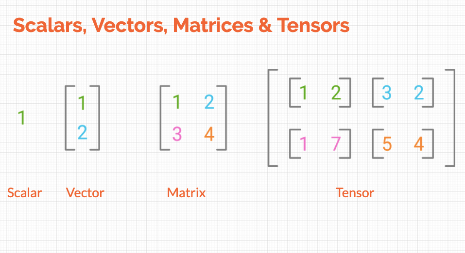

# linear algebra and numpy

<figure><figcaption></figcaption></figure>

<figure><figcaption></figcaption></figure>

Самое общее понятия это "Многомерный массив". Многомерность по сути очень похожа на пространства разной размерности: точка, прямая, плоскость, пространство. В зависимости от "мерности" массивы бывают:

1. Скаляр - тупо число. Массив размерности 0 (аналог - точка)
2. Вектор - столбец или строка с чиселками. В линале принято говорить вектор-строка и вектор-столбец, чтобы дать понять, что именно мы берем. Это массив размерности 1 (аналог - прямая).
3. Матрица - по сути это набор вектор-столбцов или вектор-строк, помним, что в зависимости от задачи нам нужно по разному смотреть на матрицу. Это массив размерности 2 (аналог - плоскость).
4. Тензор - это матрица, но вместо чиселок в каждой позиции у нас вектора (массивы). Это массив размерности 3 (аналог - 3д пространство)


Для быстрой работы со всей этой хренью есть numpy. Он написан не на питончике, а на C/C++ и поэтому работает ОЧЕНЬ быстро, если сравнивать со скоростью работы обычных питоновских списков. И так как это отдельная библиотека, которая использует свои типы данных, то нам нужно стандартные питоновские списки перевести в объект numpy.

Мы все переводим в ndarray (N-Dimensional Array), то есть буквально N-мерный (многомерный) массив. Идейно это похоже на списочки \[] или списочки списков \[\[],\[]], но более удобное и быстрое. И таким образом ndarray может быть как скаляром, так и вектором, матрицей, тензором и вообще кем ты захочешь.&#x20;

Как выглядит это дело:

```
Скаляр: array(5)

Вектор: array([1, 2, 3])

Матрица: array([[1, 2],
                [3, 4]])
                
Тензор: array([[[0., 0., 0., 0.],
                [0., 0., 0., 0.],
                [0., 0., 0., 0.]],

               [[0., 0., 0., 0.],
                [0., 0., 0., 0.],
                [0., 0., 0., 0.]]])
```

Допинфо: в нумпае опускается все что после запятой, если оно неинформативно, поэтому вместо 0.0 пишется просто 0. (точка важна, чтобы показать, что это float тип).

Во-первых, так как numpy это отдельная библиотека, они решили по красоте сделать вывод и всегда перед массивом пишется array (чтобы можно было отличить от обычного питоновского массива, к примеру).

Видим, что скаляр это просто число без квадратных скобок. Вектор тоже понятен - один массив. А вот матрица это двве скобки, втф? Здесь надо думать о том, что матрица это ОДИН объект, и первые скобки \[] нам это показывают, что мы должны рассматривать это как единое целое.

```
[
    [1, 2], первая строчка (вектор)
    [3, 4]  вторая строчка (вектор)
]
```

То есть объект (матрица) один, а внутри она состоит из двух векторов (тоже отдельных объектов).&#x20;

Такая же логика в тензорах, но тут у нас вкладываются не вектора, а целые матрицы (если посмотреть на картинку выше на тензор в 3д, то как бы делаем срез и берем по очереди матрицы):

```
[
    [                матрица 1
        [1, 2, 3],               вектор 1 в матрице 1
        [4, 5, 6],               вектор 2 в матрице 1
        [7, 7, 7]                вектор 3 в матрице 1
    ],
    
    [                матрица 2
        [1, 1, 1],               вектор 1 в матрице 2
        [2, 2, 2],               вектор 2 в матрице 2
        [6, 6, 6]                вектор 3 в матрице 2
    ]
]
```



Размерность удобно смотреть по вложенности, буквально сколько скобочек. \[ размерность 1 (вектор), \[\[ размерность 2 (матрица). \[\[\[ размерность 3 (тензор) и так далее.

Удобство нумпая в том, что мы всегда можем легко проверить, а КТО этот ndarray такое - вектор или матрица, к примеру. Или сколько там строк/столбцов. Для это мы используем СВОЙСТВА этого объекта (т.е. какие-то характеристики, которые привязаны к конкретному объекту, в нашем случае к ndarray - он может иметь определенный размер, это его свойство. Он может нести в себе данные определенного типа, это тоже его свойство, и так далее):

```
Допустим, мы создаем ndarray:

matrix = np.array([[1,2,3],
                   [4,5,6]])

теперь matrix это объект ndarray
```

И мы можем вытаскивать разную инфу из этого объекта:

```
type(matrix)     покажет <class 'numpy.ndarray'>

matrix.ndim      dimension - измерение. То есть буквально сколько 
                 измерений/осей, в каком пространстве лежит и вот все это.
                 У нас матрица, значит это строки и столбцы (аналог - плоскость),
                 значит 2 оси или 2 измерения. Поэтому код покажет "2"

matrix.shape      а тут мы хотим понять, а как длина каждой оси. То есть
                  какая длина вширь и в высоту условно (сколько элементов в 
                  строке и в столбце матрицы). Если это был бы вектор - то 
                  просто его длина. Выведет (2, 3). Сначала идет количество
                  строк (2), потом количество столбцов (3). Если мы делаем 
                  .shape у вектор, то выведет к примеру (3,) просто длину
                  вектора, запятая чтобы обозначить что это именно КОРТЕЖ, а
                  не просто скобки вокруг числа.
                  
matrix.dtype      тут какой тип данных у значений в ndarray, допустим int64

matrix.size       общее количество элементов в ndarray, у нас их 6. Можно получить
                  перемножив длину строки на длину столбца
                  
matrix.T          тут мы транспонируем - это чисто из линала, ниже покажу
```

Транспонирование это операция простая, но бобину ведет знатно, особенно на первых порах - но вещь полезная и часто применяется. Идея в том, что строки становятся столбцами, а столбцы соответственно строкам:

<figure><figcaption></figcaption></figure>

В основном это нужно для вычислений, потому что многие методы подразумевают транспонирование матриц. Когда мы транспонировали матрицу мы подписываем Т к ней, типо матрица A -> матрица A<sup>T</sup>

Теперь о функциях. Мы использовали np.array(). Это базовая функция, которая из питоновских списков, которые мы передаем (вместе со значениями), создает ndarray и сразу определяет, что это за объект, его размеры и так далее, записывая все это в свойства объекта. Можно пойти другим путем и создавать также объекты в виде матриц и списков, но сразу заполняя их определенными чиселками, например через:

```
np.zeros((2, 3, 4))
```

Тут мы просто передаем размеры массива. Это тензор из 2 матриц, в каждой из которых 3 строки и 4 столбца.


Теперь про то, как в машинке мы всю эту херь читаем:

1. В основном данные хранятся в виде МАТРИЦ (размерность 2, не забываем). И обозначается оно большой Х:

$$
X \in R^{N \times D}
$$

Читаем как "Икс большой (конкретная наша матрица) принадлежит множеству всех матриц, у которых размер N на D". Например, у нас может быть матрица 2х2, тогда она принадлежит к множеству всех матриц с таким же размером:

$$
X \in R^{2 \times 2}
$$

N - число объектов (number of samples, examples). То есть количество строк - это по сути уникальные объекты, у которых мы померили разные характеристики.

D - число признаков (number of features). То есть количество столбцов - все характеристики, которые мы мерили у объектов. К примеру рост, зарплата.

<figure><figcaption></figcaption></figure>

В нумпае это имеет следующую форму:

```
X.shape == (n_samples, n_features)
```

то есть всегда держи в уме, что первое - это количество строк, количество ОБЪЕКТОВ, а второе - это количество столбцов, количество ХАРАКТЕРИСТИК/ФИЧЕЙ.


И последнее, базовая треня. У нас есть матрица:

```
X = np.array([
    [1, 2, 3],
    [4, 5, 6],   
    [7, 8, 9]   
])

X.shape будет (3, 3). 3 строки и 3 столбца

Можем брать конкретный элемент, обращаясь к объекту X:
X[i, j]. i (итый) и j (джитый) это чисто математические обозначения, принято,
что i это номер строки, а j это номер столбца.
То есть если написать X[2, 1], то мы получим элемент последней строки и среднего
столбца в ней, т.е. 8 (считаем с 0, не забываем).

Также можно взять конкретную строку:
X[i]
или конкретный столбец
X[:, j]. Тут : так как мы все строки учитываем.
```

Ну вот и все, это база для дальнейшей работы :tada:
