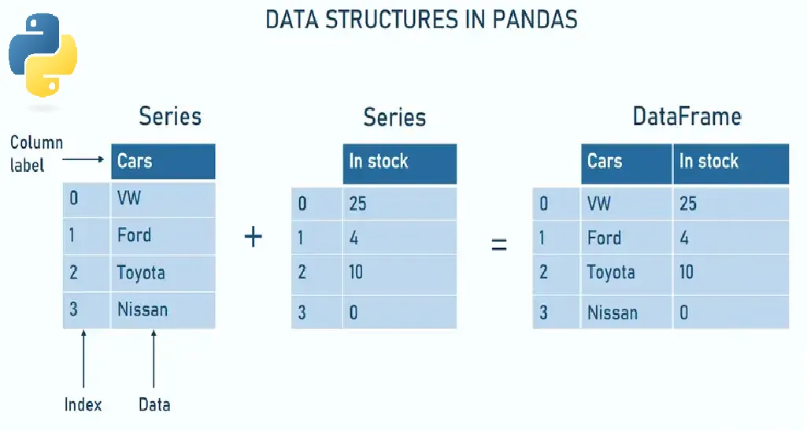
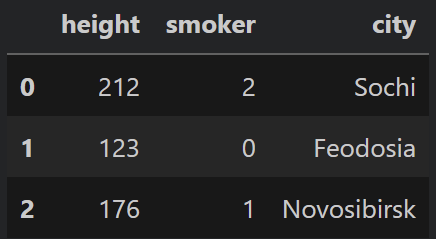

# pandas

общий вид говна разобрали, теперь в частности

Первый вопрос - нахрен пандас, если есть НуМпаЕ, в котором уже все вроде бы готово? Ответ такой: потому что нумпае это работа с математикой больше, а пандас с конкретно данными в виде таблиц. Но при этом сам пандас где-то внутри использует нумпае для упаковки данных, но сверху оборачивает этой кучей всего, чтобы нам было удобно и комфортно работать с данными. Самый простой пример: в пандасе мы можем обращаться к заголовкам столбцов, а в нумпае пришлось бы ручками считать какой нам нужен по индексу.


В пандасе есть две структуры, на которых все строится: Series (столбец, не обращай внимание на "множественное число", это как species, одна и та же форма слова для единственного и для множественного) и DataFrame (таблица). Обрати внимание, что мы уже говорим на языке экселя (столбцы, таблицы), а не на языке математики (вектора, матрицы)

<figure><figcaption></figcaption></figure>

В чем дополнительные плюшки:

1. Мы получаем удобную индексацию и возможность делать лейблы вместо чиселок (labels). Если в нумпае ты можешь обращаться только по индексу (порядковый номер строки и столбца в этой строке), то тут вместо индексов применяются лейблы, особенно для названия столбцов (Cars в таблице выше). Но также можно и для строк сделать, при этом можно делать чтобы было несколько таких индексов. Это как в таблице ниже: у нас есть два общих столбца, потом у каждого еще разделение и еще разделение. Данное чудо называется многоуровневое индексирование или multiIndex. Для строк аналогично работает. В общем и целом пандас просто пытается копировать логику работу с экселем.

<figure><figcaption></figcaption></figure>

2. У нумпае в одном векторе должны быть значения с ОДНИМ типом данных. Пандас может с разными типами данных работать, поэтому мы об этом не думаем и можем иметь таблицу, где непонятно что происходит в плане данных.
3. В нумпае пустое значение значит, что ничего просто нет и длина вектора уменьшается на 1, в пандасе на пустое место встает NaN и мы можем не ломая структуру таблицы посмотреть наши данные и пропущенные значения
4. Ну и вишенка на торте это удобство работы, а в частности всякие группировки и прочая тьма (об этом позже).


Теперь к коду. Пандас также делает свои объекты series и dataFrame на основе питоновских, в частности списков.

```
new_series = pd.Series([20, 13, 4], name="table") вызываем метод Series() для создания столбца
                                                  name это имя столбца, оно не отображается
                                                  так как у нас один столбец, но есть

Мы можем захотеть получить данные:
new_series.values и так как это свойство, то мы не ставим скобки, просто берем значения

Можно отфильтровать:
new_series[new_series > 5] сначала он делает new_series > 5, получается Series из значений
                           True, True, False. После этого мы говорим взять из new_series
                           значения, которые True (то есть первое и второе).

Можно обращаться по индексу 
new_series[0] выведет 20

```

Более крутая штука это объект DataFrame или по простому таблица.

```
df = pd.DataFrame(
{
    "height": [212, 123, 176],
    "smoker": [2,   0,   1],
    "city":   ["Sochi", "Feodosia", "Novosibirsk"],
}
)  мы здесь также через метод pandas делаем DataFrame. При этом передает мы сразу СЛОВАРЬ.
   зачем? чтобы удобно сформировать названия столбцов без их отдельного указания.
   но на самом деле способов сделать DataFrame прям несколько и всегда разный используется.
```

Получившийся датафрейм выглядит как

<figure><figcaption></figcaption></figure>

То есть ключи стали заголовками столбцов, а значения ключей стали столбцами.&#x20;

Шо можно делать с этим? Самое важное это уметь обращаться к столбц(у/ам)

1. Обращение к определенному столбцу через df\["height"] (название столбца в кавычках)
2. Обращение к нескольким столбцам через df\[\["height", "smoker"]]. Две скобки потому что мы сначала обращается к df и хотим что-то взять, а потом мы передаем список из тех столбцов, которые хотим взять.

Теперь локи-хуёки:

```
df = pd.DataFrame(
{
    "height": [212, 123, 176],
    "smoker": [2,   0,   1],
    "city":   ["Sochi", "Feodosia", "sochi"],
}, index=["victorius", "maxon", "julia"])  мы вместо индексов 0,1,2 вручную задали 
)                                          индексы строк
```

<figure><figcaption></figcaption></figure>

У dataFrame есть индексаторы (не забивай голову что это значит пока что): loc и iloc. Они нужны чтобы вытащить подтаблицу из таблицы (при этом это может быть даже просто один столбец или одна строка).

У них общая структура, сначала пишешь датайфрейм, потом через точку пишешь их, потом квадратные скобки: df.loc\[СТРОКИ, СТОЛБЦЫ] также df.iloc\[СТРОКИ, СТОЛБЦЫ]. Разница в том, что iloc работает по численным позициям (0, 1, 2), даже когда есть лейблы. К примеру у нас в таблице столбец "city", но мы знаем, что он на 2 позиции и можем так к нему и обратиться. Можно запомнить, что он по чиселкам благодаря i перед loc (типА как index). А вот loc работает чисто на названиях, к примеру "height".

Теперь конкретно по коду:

```
df.iloc[1, 0]      говорим: возьми первую строку и нулевой столбец (height), будет 123

df.iloc[0:2]       говорим: возьми строки с 0 по 2 (не включительно). Потому что 
                   df.iloc[СТРОКИ, СТОЛБЦЫ], а так как мы до запятой пишем, то он
                   работает только со строками

df.iloc[:, 1]      говорим: возьми ВСЕ строки, и возьми у них у всех ПЕРВЫЙ столбец,
                   получим 2, 0, 1 с индексами строк
                     
df.iloc[1:3, 0:2]  а здесь мы вырезаем подтаблицу из целой таблицы: сколько то строк и
                   сколько то столбцов
```

в противовес работа с loc:

```
df.loc["julia", "city"]          говорим: возьми строку с лэйблом julia и возьми столбец
                                 с названием city, получим sochi
                                      
df.loc["victorius":"maxon"]      говорим: возьми строки от викториуса до максон
           
df.loc[:, "height"]              говорим: возьми ВСЕ строки, и возьми столбец с именем
                                 height
df.loc[["victorius","julia"], ["city","smoker"]] а здесь также подтаблицу получаем
```

Что еще круто знать для работы с датафреймами? Во первых базовое получение инфы из них:

```
df.head(5)       обращаемся к датафрейме и говорим показать 5 САМЫХ верхних строк
df.tail(7)       а здесь наоборот, tail - хвост, просим 7 самых нижних строк
df.describe()    тут оно берет каждую колонку с ЧИСЛОВЫМИ данными и считает в ней
                 среднее, стандартное отклонение, максимум и минимум, процентили, короче
                 всякую статистику.                
df.shape         как в нумпае, посмотреть размеры таблицы, выведет в нашем случае (3, 3)
```

И работа с пустыми значениями:

```
df.isna().sum()     оно покажет сколько пропусков в КАЖДОЙ колонке. Сначала df.isna()
                    вместо значений в ячейках таблицы поставит false или true в зависимости
                    от того NaN там или нет. А потом .sum() по каждому столбцу посчитает
                    их
                    
df.dropna()         удаляем строки с NaNaми

df.fillna(value=5)  а тут мы вместо удаления говорим: заполни все NaN пятеркой (5),
                    можно поставить 0, а можно среднее или вообще все что угодно 
```

Почти в каждых методах и прочей хрени в пандасе есть указание axis, то есть оси, по которой будет работать метод - либо по строкам, либо по столбцам. Сначала непонятно, но потом начинаешь чувствовать. axis=0 это движение по строкам, axis=1 по столбцам.

<figure><figcaption></figcaption></figure>

К примеру:

```
df.sum(axis=0) суммируем ВНИЗ по СТРОКАМ (то есть каждую строчку складываем). В итоге
               получаем сумму в каждом столбце (это стандартное значение при вызове
               метода)

df.sum(axis=1) суммируем ВПРАВО по СТОЛБЦАМ (то есть складываем в каждой строке все
               столбцы). В итоге получаем сумму в каждой строке.
```

И таким образом можно регулировать работу очень многих вещей в пандасе.
